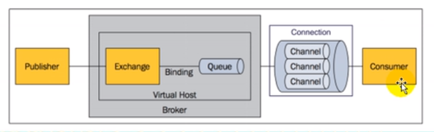
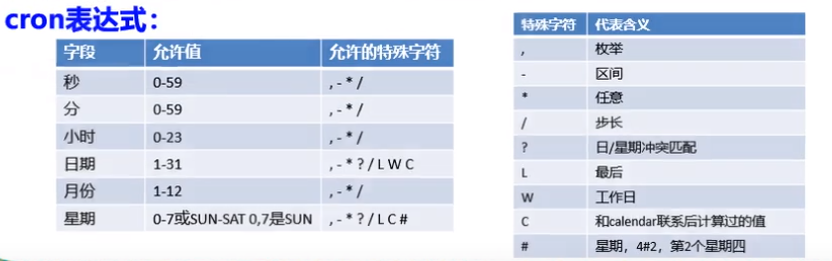
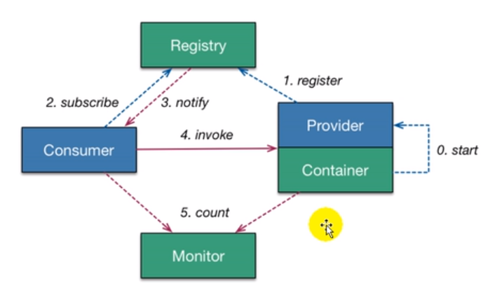

# 一、String Boot入门  

#### 1、Spring Boot简介  

1、简化Spring应用开发的一个框架；

2、整个Spring技术栈的一个大整合；  

3、J2EE开发的一站式解决方案；

#### 2、微服务  

微服务：架构风格（服务微化）

一个应用应该是一组小型服务；可以通过HTTP的方式进行互通；

每一个功能元素最终都是一个可独立替换和独立升级的软件单元

[详细参照微服务文档](https://martinfowler.com/articles/microservices.html#MicroservicesAndSoa)  

环境约束：  

1、jdk1.8;

2、maven3.3.9;

3、IntelliJIDEA2017;

4、SpringBoot 1.5.9.RELEASE;

设置maven启动jdk版本，给maven的setting配置文件添加  

```
java
<profiles> 
	<profile> 
		<id>jdk1.8</id>
		<activation>
			<activeByDefault>true</activeByDefault>
		</activation>
		<properties>
			<maven.compiler.source>1.8</maven.compiler.source>
			<maven.compiler.target>1.8</maven.compiler.target>
			<maven.compiler.compilerVersion>1.8</maven.compiler.compilerVersion>
		</properties>
	</profile>
</profiles>  
```

#### 3、Spring Boot项目HelloWorld  

功能：浏览器发送hello请求，服务器接收请求处理，响应hello world字符串；

1.创建一个maven工程；（jar)

2.导入依赖spring boot相关的依赖  

```java
<parent>
   <groupId>org.springframework.boot</groupId>
   <artifactId>spring-boot-starter-parent</artifactId>
   <version>1.5.9.RELEASE</version>
   <relativePath/> <!-- lookup parent from repository -->
</parent>
<dependencies>
    <dependency>
        <groupId>org.springframework.boot</groupId>
        <artifactId>spring-boot-starter-web</artifactId>
    </dependency>
</dependencies>  
```
3、编写一个主程序；启动spring boot应用，必须放在src/main/java的自己创建的目录下，才会正常启动；  

```java
    /**
      * Description: 标注主程序类，说明是一个SpringBoot类
      *
      * @Date:2019/4/13
      * @Author:lc
     */
    @SpringBootApplication
    public class HelloSpringBootApplication {
        public static void main(String[] args) {
            //spring应用启动起来
            SpringApplication.run(HelloSpringBootApplication.class, args);
        }
    }
```

4、编写相关的controller、service  

```java
	/**
	  * Description: 方法输出文本"hello Spring Boot"
      *
      * @Date:2019/4/13
      * @Author:lc
    */
    @Controller
    @RequestMapping("/api")
    public class HelloSpringBoot {
        @ResponseBody
        @RequestMapping("/hello")
        public String hello() {
            return "hello Spring Boot";
        }
    }
```

5、启动项目：直接运行启动类的主程序，再使用浏览器http调用；

6、简化部署  

```java
<!--插件作用：可以将应用打包成一个可执行的jar包-->

    <build>
        <plugins>
            <plugin>
                <groupId>org.springframework.boot</groupId>
                <artifactId>spring-boot-maven-plugin</artifactId>
                <configuration>
                    <executable>true</executable>
                    <fork>false</fork>
                </configuration>
            </plugin>
        </plugins>
    </build>  
```

导入插件，在当前目录下直接使用java -jar spring_boot_01-1.0-SNAPSHOT.jar命令，运行程序；

#### 4、Hello World探究

1、POM文件：父项目

```java
<parent>
    <groupId>org.springframework.boot</groupId>
    <artifactId>spring-boot-starter-parent</artifactId>
    <version>1.5.9.RELEASE</version>
    <relativePath/> <!-- lookup parent from repository -->
</parent>
```


它的父项目  

```java
<parent>
	<groupId>org.springframework.boot</groupId>
	<artifactId>spring-boot-dependencies</artifactId>
	<version>1.5.9.RELEASE</version>
	<relativePath>../../spring-boot-dependencies</relativePath>
</parent>
```
它来真正管理Spring Boot应用里面的所有依赖版本；  

Spring Boot的版本仲裁中心；
以后我们导入依赖默认是不需要写版本；（没有在dependences里面管理的依赖自然需要声明版本号；  

2、启动器  

```java
<dependency>
    <groupId>org.springframework.boot</groupId>
    <artifactId>spring-boot-starter-web</artifactId>
</dependency>
```

spring-boot-starter:spring-boot场景启动器；帮我们导入了web模块正常运行所依赖的组件；  
Spring Boot将所有的功能场景都抽取出来，做成一个个的starters（启动器),只需要再项目里面引入这些starter相关场景的所有依赖就会导入进来；要用什么功能就导入什么场景的启动器。

3、主程序类，主入口类

```java
@SpringBootApplication
public class HelloSpringBootApplication {
	public static void main(String[] args) {
	    //spring应用启动起来
		SpringApplication.run(HelloSpringBootApplication.class, args);
	}
} 
```


 @SpringBootApplication：SpringBoot应用标注在某个类上说明这个类是SpringBoot的主配置类，SpringBoot就应该运行这个类的main方法来启动SpringBoot应用；  

	@Target({ElementType.TYPE})
	@Retention(RetentionPolicy.RUNTIME)
	@Documented
	@Inherited
	@SpringBootConfiguration
	@EnableAutoConfiguration
	@ComponentScan(
	    excludeFilters = {@Filter(
	    type = FilterType.CUSTOM,
	    classes = {TypeExcludeFilter.class}
	), @Filter(
	    type = FilterType.CUSTOM,
	    classes = {AutoConfigurationExcludeFilter.class}
	)}
	)  
@SpringBootConfiguration：SpringBoot配置类；  
标注在某个类上，表示这是一个SpringBoot的配置类；  
父配置：@Configuration：配置类上标注这个注解；  
配置类====配置文件；配置类也是容器的一个组件；  
@EnableAutoConfiguration：开启自动配置功能；  
父配置：@AutoConfigurationPackage：将主配置类（@SpringBootConfiguration注解标注的类）的所在包及所属子包里面的所有组件扫描到spring容器；

4、使用Spring Initializer快速创建Spring Boot项目  

IDE都支持使用Spring的项目创建向导快速创建一个Spring Boot项目；  
向导会联网创建Spring Boot项目；  
默认生成的Spring Boot项目的特点：  
（1）主程序已经自动生成好了，只需要完成自己的逻辑开发；  
（2）resources文件夹中目录结构：  
①static：保存所有的静态资源：js css images；  
②templates：保存所有的模板页面：可以使用模板引擎（freemarker、thymeleaf）；  
③application.properties:spring boot应用的配置文件；

# 二、配置文件

#### 1、配置文件  

SpringBoot使用一个全局的配置文件，配置文件名是固定的；  
①application.properties;  
②application.yml。  
配置文件的作用：修改springboot自动配置的默认值；  

#### 2、获取application.properties属性  

通过@ConfigurationProperties(prefix="person")对象注解，获取以person为前缀的属性值放入当前对象的属性中。

#### 3、解决获取application.properties乱码问题  

①在配置文件中加入配置  

	server.tomcat.uri-encoding=UTF-8
	spring.http.encoding.charset=UTF-8
	spring.http.encoding.enabled=true
	spring.http.encoding.force=true
	spring.messages.encoding=UTF-8
②还是乱码，修改idea配置  
设置 File Encodings的Transparent native-to-ascii conversion为true，  
具体步骤如下：依次点击
File -> Settings -> Editor -> File Encodings
将Properties Files (*.properties)下的Default encoding for properties files设置为UTF-8，将Transparent native-to-ascii conversion前的勾选上。  

#### 4、比较使用@ConfigurationProperties(prefix="person")和使用@Value()获取属性的区别  

@ConfigurationProperties:支持松散绑定（userName或user-name),@Value不支持；  
@ConfigurationProperties：不支持SpEL(#{1+2}),@Value支持；  
@ConfigurationProperties：支持JSR303数据校验，@Value不支持；
@ConfigurationProperties：支持复杂类型封装（Map,List),@Value不支持；  
如果说，我们只是在某个业务逻辑中需要获取一下配置文件中的某项值，使用@Value；  
如果说，我们专门编写了一个javaBean来和配置文件进行配置，我们就直接使用@ConfigurationProperties;

#### 5、@PropertySource("classpath:person.properties")，通过对象注解获取指定配置文件属性值；

#### 6、@ImportResource(locations = {"classpath:boot.xml"})，导入spring的配置文件，让配置文件里边的内容生效，标注在主配置类上； 
#### 7、文件  

①对象：  

```java
@Component
@PropertySource("classpath:person.properties")
//@ConfigurationProperties(prefix="person")
//@Validated
public class Person {
    //@Email
    //@Value("${person.name}")
    private String name;
    //@Value("#{12+5}")
    private Integer age;
    //@Value("true")
    private Boolean boss;
    //@Value("2019/4/14")
    private Date birthday;
    private Map<String, Object> maps;
    private List<Object> list;
    private Dog dog;

    public String getName() {
        return name;
    }

    public void setName(String name) {
        this.name = name;
    }

    public Integer getAge() {
        return age;
    }

    public void setAge(Integer age) {
        this.age = age;
    }

    public Boolean getBoss() {
        return boss;
    }

    public void setBoss(Boolean boss) {
        this.boss = boss;
    }

    public Date getBirthday() {
        return birthday;
    }

    public void setBirthday(Date birthday) {
        this.birthday = birthday;
    }

    public Map<String, Object> getMaps() {
        return maps;
    }

    public void setMaps(Map<String, Object> maps) {
        this.maps = maps;
    }

    public List<Object> getList() {
        return list;
    }

    public void setList(List<Object> list) {
        this.list = list;
    }

    public Dog getDog() {
        return dog;
    }

    public void setDog(Dog dog) {
        this.dog = dog;
    }

    @Override
    public String toString() {
        return "Person{" +
                "name='" + name + '\'' +
                ", age=" + age +
                ", boss=" + boss +
                ", birthday=" + birthday +
                ", maps=" + maps +
                ", list=" + list +
                ", dog=" + dog +
                '}';
    }
}  
```
主配置类：  

```java
@SpringBootApplication
@ImportResource(locations = {"classpath:boot.xml"})
public class SpringBoot02Application {

	public static void main(String[] args) {
		SpringApplication.run(SpringBoot02Application.class, args);
	}

}  
```
#### 8、使用第二种方式替换@ImportResource(locations = {"classpath:boot.xml"})生成spring的xml配置文件；  

	    /**
		 * Description:指明当前类是一个配置类；就是替代spring的xml配置文件
		 *
		 * @Date:2019/4/14
		 * @Author:lc
		 */
		@Configuration
		public class SpringBootConfig {
	        // 将方法的返回值添加到容器中；容器中这个组件默认的id就是方法名
	        @Bean
	        public BootService bootService() {
	            return new BootService();
	        }
	
	    }
#### 9、配置文件占位符  

①随机数  

```java
${random.value} ${random.int} ${random.long}   
${random.int(10)} ${random.int[1024, 65536]} ${random.uuid}  
```
②没有默认值可以自定义（person.data没有值，那就用李代替）  

```java
person.dog.name=${person.data:李}_雪碧  
```
#### 10、spring.profiles.active=dev，用来激活启动版本，使用dev版本启动spring boot  

#### 11、server.servlet.context-path=/boot，URL添加固定配置，访问如：http://localhost:8022/boot/api/study  

#### 12、debug=true, 查看所有的可用配置文件和不可用配置文件

# 三、日志  

springboot的日志为log4j2(作用于接口）+logback（作用于实现类）。  
日志级别，由低到高trace<debug<info<warn<error。  

application.properties配置文件中设置：  
① logging.level.com.lc = trace;自定义设置日志级别，默认为info；  
② logging.file=logging.xml;将日志打印在项目根目录下，生成logging.xml文件中；  
③ logging.path=/spring/logging;将日志打印在项目盘符下/spring/logging路径下生成logger.log中；  

# 四、WEB开发  

#### 1、静态文件存放路径 

 ①classpath：/resources;  
②classpath：/static;  
③classpath：/public;  
自动从三个资源文件中寻找css、js等配置文件资源。  

#### 2、HTML模板引擎存放路径

classpath：/templates，必须引入spring-boot-starter-thymeleaf的jar包，默认查找index.html

#### 3、使用jsp文件

创建存放jsp的路径WEB-INF/jsp,需要创建WEB-INF/web.xml, 


需要引入spring-boot-starter-tomcat和tomcat-jasper的jar包，  
application.properties需要配置前后缀：spring.mvc.view.prefix=/WEB-INF/jsp/和spring.mvc.view.suffix=.jsp  

使用Apache的tomcat启动项目：


#### 4、pom.xml依赖jar包
	    <!-- 依赖父项目，版本控制 --> 
	    <parent>
	        <groupId>org.springframework.boot</groupId>
	        <artifactId>spring-boot-starter-parent</artifactId>
	        <version>1.5.13.RELEASE</version>
	        <relativePath/> <!-- lookup parent from repository -->
	    </parent>
	
	    <!-- 自定义配置版本 -->
	    <properties>
	        <java.version>1.8</java.version>
	    </properties>
	
	    <dependencies>
		<!-- web项目开发，使用自定义日志文件 -->
		<dependency>
			<groupId>org.springframework.boot</groupId>
			<artifactId>spring-boot-starter-web</artifactId>
			<exclusions>
				<exclusion>
					<groupId>org.springframework.boot</groupId>
					<artifactId>spring-boot-starter-logging</artifactId>
				</exclusion>
			</exclusions>
		</dependency>
		
	    <!-- 测试jar -->
		<dependency>
			<groupId>org.springframework.boot</groupId>
			<artifactId>spring-boot-starter-test</artifactId>
			<scope>test</scope>
		</dependency>
		
	    <!-- log4j2日志 -->
		<dependency>
			<groupId>org.springframework.boot</groupId>
			<artifactId>spring-boot-starter-log4j2</artifactId>
		</dependency>
	
		<!-- 使用thymeleaf模板引擎 -->
		<dependency>
			<groupId>org.springframework.boot</groupId>
			<artifactId>spring-boot-starter-thymeleaf</artifactId>
		</dependency>
	
		<!-- 连接mybatis -->
		<dependency>
			<groupId>org.mybatis.spring.boot</groupId>
			<artifactId>mybatis-spring-boot-starter</artifactId>
			<version>1.3.2</version>
		</dependency>
	
		<dependency>
			<groupId>mysql</groupId>
			<artifactId>mysql-connector-java</artifactId>
		</dependency>
	
		<!-- 使用alibaba数据源druid -->
		<dependency>
	        <groupId>com.alibaba</groupId>
	        <artifactId>druid</artifactId>
	        <version>1.1.9</version>
		</dependency>
	</dependencies>
	
	<!-- 定义一个可执行jar文件 -->
	<build>
		<plugins>
			<plugin>
				<groupId>org.springframework.boot</groupId>
				<artifactId>spring-boot-maven-plugin</artifactId>
			</plugin>
		</plugins>
	</build>
#### 5、application.properties配置文件  
	spring.datasource.driver-class-name=com.mysql.jdbc.Driver
	spring.datasource.url=jdbc:mysql://127.0.0.1:3306/springboot?characterEncoding=utf8
	spring.datasource.username=root
	spring.datasource.password=root
	spring.datasource.type=com.alibaba.druid.pool.DruidDataSource
	#初始连接数
	spring.datasource.druid.initial-size=5
	#最大连接数
	spring.datasource.druid.max-active=20
	#最小空闲
	spring.datasource.druid.min-idle=5
	#最大等待时间
	spring.datasource.druid.max-wait=6000
	#每60秒运行一次空闲连接回收器
	spring.datasource.druid.time-between-eviction-runs-millis=60000
	#池中的连接空闲5分钟后被回收
	spring.datasource.druid.min-evictable-idle-time-millis=300000
	#验证使用的SQL语句
	spring.datasource.druid.validation-query=SELECT 1 FROM DUAL
	#指明连接是否被空闲连接回收器(如果有)进行检验.如果检测失败,则连接将被从池中去除.
	spring.datasource.druid.test-while-idle=true
	#借出连接时不要测试，否则很影响性能
	spring.datasource.druid.test-on-borrow=false
	#生产环境归还连接时不要测试
	spring.datasource.druid.test-on-return=false
	#是否自动回收超时连接
	spring.datasource.druid.remove-abandoned=true
	#超时时间(以秒数为单位)
	spring.datasource.druid.remove-abandoned-timeout=10
	#是否在自动回收超时连接的时候打印连接的超时错误
	spring.datasource.druid.log-abandoned=true
	# 配置监控统计拦截的filters，去掉后监控界面sql无法统计，'wall'用于防火墙
	spring.datasource.druid.filters=stat,wall,log4j
	# 是否缓存preparedStatement，也就是PSCache  官方建议MySQL下建议关闭   个人建议如果想用SQL防火墙 建议打开
	spring.datasource.druid.pool-prepared-statements=true
	# 最大的连接池就绪等待连接数量
	spring.datasource.druid.max-pool-prepared-statement-per-connection-size=20
	
	#mybatis配置文件路径
	mybatis.config-location=classpath:mybatis/mybatis-config.xml
	#mybatis映射文件xml存放路径
	mybatis.mapper-locations=classpath:mybatis/mapper/*.xml
#### 6、mybatis-config.xml配置文件
	<?xml version="1.0" encoding="UTF-8" ?>
	<!DOCTYPE configuration
	        PUBLIC "-//mybatis.org//DTD Config 3.0//EN"
	        "http://mybatis.org/dtd/mybatis-3-config.dtd">
	<configuration>
	    <settings>
			<!--设置驼峰命名格式，将表中user_name转化为类中的userName -->
	        <setting name="mapUnderscoreToCamelCase" value="true"/>
	    </settings>
	</configuration>
第二种方式mybatis自定配置MyMybatisConfig.java  

	@Configuration
	public class MyMybatisConfig {
	    @Bean
	    public ConfigurationCustomizer configurationCustomizer() {
	        return new ConfigurationCustomizer() {
	            @Override
	            public void customize(org.apache.ibatis.session.Configuration configuration) 			 {
	                configuration.setMapUnderscoreToCamelCase(true);
	            }
	        };
	    }
	}
#### 7、druid数据源配置文件MyDruidConfig.java  
	@Configuration
	public class MyDruidConfig {
	
	    @ConfigurationProperties(prefix = "spring.datasource")
	    @Bean
	    public DataSource druid() {
	        return new DruidDataSource();
	    }
	
		// 使用servlet功能
	    @Bean
	    public ServletRegistrationBean statViewServlet() {
	        ServletRegistrationBean bean = new ServletRegistrationBean(new StatViewServlet(), "/druid/*");
	        Map<String, String> map = new HashMap<String, String>();
	        map.put("loginUsername", "admin");
	        map.put("loginPassword", "123");
	        bean.setInitParameters(map);
	        return bean;
	    }
	
		// 使用过滤器功能
	    @Bean
	    public FilterRegistrationBean filterRegistrationBean() {
	        FilterRegistrationBean bean = new FilterRegistrationBean();
	        bean.setFilter(new WebStatFilter());
	        Map<String, String> map = new HashMap<>();
	        map.put("exclusions", "*.js, *.css, /druid/*");
	        bean.setInitParameters(map);
	        bean.setUrlPatterns(Arrays.asList("/*"));
	        return bean;
	    }
	
	}
#### 8、自定义登录拦截器MyLoginHandlerInterceptor.java  
	public class MyLoginHandlerInterceptor implements HandlerInterceptor {
	
	    @Override
	    public boolean preHandle(HttpServletRequest request, HttpServletResponse response, Object o) throws Exception {
	        String loginUsername = (String)request.getSession().getAttribute("loginUser");
	        if(!StringUtils.isEmpty(loginUsername)) {
	            return true;
	        }
	        request.setAttribute("msg", "没有权限请先登录");
	        request.getRequestDispatcher("/index.html").forward(request, response);
	        return false;
	    }
	
	    @Override
	    public void postHandle(HttpServletRequest httpServletRequest, HttpServletResponse httpServletResponse, Object o, ModelAndView modelAndView) throws Exception {
	
	    }
	
	    @Override
	    public void afterCompletion(HttpServletRequest httpServletRequest, HttpServletResponse httpServletResponse, Object o, Exception e) throws Exception {
	
	    }
	}
#### 9、拦截控制转发请求对应资源

	@Configuration
	public class MyMvcConfig implements WebMvcConfigurer{
		// 转发强求到到指定页面中
	    public void addViewControllers(ViewControllerRegistry registry) {
	        registry.addViewController("/").setViewName("login");
	        registry.addViewController("/index.html").setViewName("login");
	        registry.addViewController("/login.html").setViewName("login");
	    }
	    
	    // 使自己定义的拦截器生效
	    public void addInterceptors(InterceptorRegistry registry) {
	        registry.addInterceptor(new MyLoginHandlerInterceptor()).addPathPatterns("/**")
	            .excludePathPatterns("/index.html", "/", "/user/login");
	    }
	
	}

## 五、与定时任务Quartz和定时器Core结合使用 

#### 1、pom.xml引入Quartz依赖 

```java
		<dependency>
			<groupId>org.quartz-scheduler</groupId>
			<artifactId>quartz</artifactId>
			<version>2.3.1</version>
		</dependency>

		<dependency>
			<groupId>org.quartz-scheduler</groupId>
			<artifactId>quartz-jobs</artifactId>
			<version>2.3.1</version>
		</dependency>

		<dependency>
			<groupId>org.springframework</groupId>
			<artifactId>spring-context-support</artifactId>
			<version>4.3.13.RELEASE</version>
		</dependency>
```

#### 2、添加quartz.properties配置文件 

```java
org.quartz.scheduler.instanceName = cloudScheduler 
org.quartz.scheduler.instanceId = AUTO  

org.quartz.threadPool.class = org.quartz.simpl.SimpleThreadPool 
org.quartz.threadPool.threadCount = 10 
org.quartz.threadPool.threadPriority = 5 
org.quartz.threadPool.threadsInheritContextClassLoaderOfInitializingThread = true 

org.quartz.jobStore.misfireThreshold = 60000


#org.quartz.jobStore.class属性为 JobStoreTX，将任务持久化到数据中。   
#集群中节点依赖于数据库来传播 Scheduler 实例的状态，你只能在使用 JDBC JobStore 时应用 Quartz 集群。   
org.quartz.jobStore.class = org.quartz.impl.jdbcjobstore.JobStoreTX 
org.quartz.jobStore.driverDelegateClass=org.quartz.impl.jdbcjobstore.StdJDBCDelegate 
org.quartz.jobStore.tablePrefix = QRTZ_
org.quartz.jobStore.maxMisfiresToHandleAtATime=10 
#org.quartz.jobStore.isClustered 属性为 true，实例要它参与到一个集群当中。   
org.quartz.jobStore.isClustered = false  
org.quartz.jobStore.clusterCheckinInterval = 3600000
```

#### 3、生成quartz表

```
QRTZ_JOB_DETAILS，
QRTZ_TRIGGERS，
QRTZ_SIMPLE_TRIGGERS，
QRTZ_CRON_TRIGGERS，
QRTZ_SIMPROP_TRIGGERS，
QRTZ_BLOB_TRIGGERS，
QRTZ_CALENDARS，
QRTZ_PAUSED_TRIGGER_GRPS，
QRTZ_FIRED_TRIGGERS，
QRTZ_SCHEDULER_STATE，
QRTZ_LOCKS
```

#### 4、配置jobFactory，使用@Autowired注解注入 

```java
@Component("jobFactory")
public class AutoWiredSpringBeanToJobFactory extends SpringBeanJobFactory implements ApplicationContextAware {
    private transient AutowireCapableBeanFactory beanFactory;

    @Override
    public void setApplicationContext(final ApplicationContext context) {
        beanFactory = context.getAutowireCapableBeanFactory();
    }

    @Override
    protected Object createJobInstance(final TriggerFiredBundle bundle) throws Exception 	 {
        final Object job = super.createJobInstance(bundle);
        beanFactory.autowireBean(job);
        return job;
    }
}
```

#### 5、引入quartz.properties文件，配置数据源

```java
@Configuration
public class QuartzConfig {
    // 配置文件路径
    private static final String QUARTZ_CONFIG = "/quartz.properties";

    // 查询系统中配置好的数据源添加到配置
    @Autowired
    @Qualifier(value = "dataSource")
    private DataSource dataSource;
    @Autowired
    private JobFactory jobFactory;

    /**
     * @return
     * @throws IOException
     */
    @Bean("schedulerFactoryBean")
    public SchedulerFactoryBean schedulerFactoryBean() throws IOException {
        //从quartz.properties文件中读取Quartz配置属性
        PropertiesFactoryBean propertiesFactoryBean = new PropertiesFactoryBean();
        propertiesFactoryBean.setLocation(new ClassPathResource(QUARTZ_CONFIG));
        //在quartz.properties中的属性被读取并注入后再初始化对象
        propertiesFactoryBean.afterPropertiesSet();

        //创建SchedulerFactoryBean
        SchedulerFactoryBean factory = new SchedulerFactoryBean();
        factory.setQuartzProperties(propertiesFactoryBean.getObject());
        // 使用应用的dataSource替换quartz的dataSource
        factory.setDataSource(dataSource);
        factory.setJobFactory(jobFactory);

        factory.setOverwriteExistingJobs(true);
        // 设置自行启动
        factory.setAutoStartup(true);

        return factory;
    }

}
```

#### 6、得到spring管理的类名称工具SpringUtil.java

```java
@Component
public class SpringUtil implements ApplicationContextAware {
   /**
    * 上下文对象实例
    */
   public static ApplicationContext applicationContext;

   @Override
   public void setApplicationContext(ApplicationContext applicationContext) throws BeansException {
      if(applicationContext!=null&&this.applicationContext==null){
         this.applicationContext = applicationContext;
      }
   }

   /**
    * 获取applicationContext
    * 
    * @return
    */
   public static ApplicationContext getApplicationContext() {
      return applicationContext;
   }

   /**
    * 通过name获取 Bean.
    * 
    * @param name
    * @return
    */
   public static Object getBean(String name) {
      return getApplicationContext().getBean(name);
   }

   /**
    * 通过class获取Bean.
    * 
    * @param clazz
    * @param <T>
    * @return
    */
   public static <T> T getBean(Class<T> clazz) {
      return getApplicationContext().getBean(clazz);
   }

   /**
    * 通过name,以及Clazz返回指定的Bean
    * 
    * @param name
    * @param clazz
    * @param <T>
    * @return
    */
   public static <T> T getBean(String name, Class<T> clazz) {
      return getApplicationContext().getBean(name, clazz);
   }
}
```

#### 7、生成定时任务JobUtil.java

```java
public class JobUtil {

    public static final Logger logger = LoggerFactory.getLogger(JobUtil.class);

    private static JobUtil jobUtil = new JobUtil();

    public static Scheduler scheduler = null;

    private JobUtil() {
        logger.info("SchedulerMain is created");
    }

    // 使用单例代替spring管理注入
    public static JobUtil getInstance() {
        if (scheduler == null){
            synchronized (JobUtil.class){
                if (scheduler == null){
                    scheduler = SpringUtil.getBean(Scheduler.class);
                }
            }
        }
        return jobUtil;
    }

    public void addSchedulerJob(String quartzName,String quartzGroup, 
                                String cronExpression) throws Exception {

        JobDetail jobDetail = JobBuilder.newJob(EmployerJob.class)
            .withIdentity(quartzName, quartzGroup)
            .storeDurably(false).build();

        Trigger trigger = TriggerBuilder.newTrigger().forJob(jobDetail)
            .withIdentity(quartzName, quartzGroup)
            .withSchedule(CronScheduleBuilder.cronSchedule(cronExpression)).build();

        scheduler.scheduleJob(jobDetail, trigger);
        scheduler.start();
    }

    // 调用任务用到反射，实体类必须序列化
    public void addSchedulerTask(Task task, TaskPloy taskPloy) throws Exception{

        String name = task.getName();
        String group = task.getTaskGroup();

        // 先停止删除定时任务
        scheduler.unscheduleJob(TriggerKey.triggerKey(name, group));
        scheduler.deleteJob(JobKey.jobKey(name, group));

        JobDataMap jobDataMap = new JobDataMap();
        jobDataMap.put("task", task);
        jobDataMap.put("taskPloy", taskPloy);

        JobDetail jobDetail = JobBuilder.newJob(TaskJob.class)
            	.withIdentity(name, group).storeDurably(false)
                .requestRecovery().setJobData(jobDataMap).build();

        Trigger trigger = TriggerBuilder.newTrigger().forJob(jobDetail)
               .withIdentity(name, group)
               .withSchedule(CronScheduleBuilder.cronSchedule(task.getConfig())).build();

        // 再开启定时任务
        scheduler.scheduleJob(jobDetail, trigger);
        scheduler.start();
    }

    public void taskStop(Task task) throws SchedulerException {
        String name = task.getName();
        String group = task.getTaskGroup();
        scheduler.unscheduleJob(TriggerKey.triggerKey(name, group));
    }

}
```

用到spring反射机制，实体类必须序列化。

## 六、springboot与docker结合使用

#### 1、环境描述

①虚拟机网络适配器为桥接模式，IP和主机为同一网段，互相可以ping通，ping操作时主机需要关闭防火墙；

②linux的镜像centOS必须是64位，查询内核版本(uname -r)且内核版本需要是2.6.32版本及以上；

#### 2、使用docker

①安装第三方库：yum install https://get.docker.com/rpm/1.7.1/centos-6/RPMS/x86_64/docker-engine-1.7.1-1.el6.x86_64.rpm

②安装docker-io：yum install docker-io；

出现错误No package docker-io available，以下两种解决方法：

```java
yum install epel-release
yum install docker-io
```

或

```JAVA
yum upgrade device-mapper-lib
yum install docker-io
```

启动docker：service docker start

测试：查看docker版本：docker -v，查看mysql镜像：docker search mysql；

③镜像操作，拉取存放容器中


④启动容器

​      	

⑤启动mysql数据库，生成编码格式

docker run -p 3306:3306 -e MYSQL_ROOT_PASSWORD=root --name mysql -d mysql:5.6.42 --character-set-server=utf8mb4 --collation-server=utf8mb4_unicode_ci

## 七、springboot使用缓存  

#### 1、spring缓存抽象  

**①**pom.xml导入依赖    

```java
<dependency>
	<groupId>org.springframework.boot</groupId>
	<artifactId>spring-boot-starter-cache</artifactId>
</dependency>
```

**②**在程序入口主函数中添加注解@EnableCaching，使用spring抽象缓存；

**③**需要被缓存的方法上添加注解@Cacheable(cacheNames = "emp")；

原理：先查询缓存是否有数据，有就直接返回，没有就查询数据库，返回的数据存入缓存，缓存的key为方法参数，没有参数spring自动生成，一个参数情况就为key，多个参数组合使用为key；

Cacheable其他属性：

**key**：如key = "#root.methodName+'['+#id+']'"，自定义key，#root.methodName获取方法名，#id获取参数；

**condition**：如condition = "#id > 1 and #root.getMethodName() eq 'getDepartmentById'"，自定义条件id>1并且方法名为getDepartmentById时进行缓存；

**unless**：如unless = "#id == 2"，自定义id=2时不进行缓存；

**④**修改方法上添加@CachePut(value = "emp", key = "#result.id") 修改方法并更新缓存，存入缓存时的key为对象id时，更新时，应该也要从对象中取出id去更新缓存；

**⑤**删除方法上添加@CacheEvict(value = "emp", key = "#id")删除方法执行之后并删除以id值为key的缓存，可以使用allEntries = true代替key，删除所有的缓存；

#### 2、使用redis缓存

1、Redis的常用五大数据类型

String【字符串】、List【列表】、Set【集合】、Hash【散列】、ZSet【有序集合】

分为两种一种是**StringRedisTemplate**，另一种是**RedisTemplate**

根据不同的数据类型，大致的操作也分为这5种，以StringRedisTemplate为例

```
stringRedisTemplate.opsForValue()  --String
stringRedisTemplate.opsForList()  --List
stringRedisTemplate.opsForSet()  --Set
stringRedisTemplate.opsForHash()  --Hash
stringRedisTemplate.opsForZset()  -Zset
```

2、redis操作

①pom.xml导入依赖

```java
<dependency>
	<groupId>org.springframework.boot</groupId>
	<artifactId>spring-boot-starter-data-redis</artifactId>
</dependency>
```

②redis配置参数

```java
spring.redis.database=1  //自定义库，默认db0
spring.redis.host=192.168.10.203  //连接redis库
spring.redis.port=6379  //端口号
```

③自定义的json对象

```java
@Configuration
public class MyRedisConfig {
    @Bean
    public RedisTemplate<Object, Department> serRedisTemplate(
            RedisConnectionFactory redisConnectionFactory) {
        RedisTemplate<Object, Department> template = new RedisTemplate<>();
        template.setConnectionFactory(redisConnectionFactory);
        Jackson2JsonRedisSerializer<Department> ser = new  Jackson2JsonRedisSerializer<Department>(Department.class);
        template.setDefaultSerializer(ser);
        return template;
    }
}
```

④实现缓存

```java
@Autowired
private RedisTemplate<Object, Department> serRedisTemplate;

@Override
public Department getDepartmentById(Long id) {
    if(id == null) {
        throw new RuntimeException("参数错误");
    }
    try {
        Department department = serRedisTemplate.opsForValue().get(id);
        if(department == null) {
            System.out.println(id + "号部门");
            department = departmentMapper.getDepartmentById(id);
        	serRedisTemplate.opsForValue().set(id, department);
   		}
        return department;
    } catch (Exception e) {
        throw new RuntimeException("查询部门出错", e);
    }
}
```

## 八、springboot与消息中间件整合使用

##### 1、rabbitMQ

原理：发布者将消息发送给消息服务器，消息服务器接收到消息，根据规则发送给其内部的交换机，交换机接收到消息根据规则分发给队列，接受者通过TCP和消息服务器建立连接，将消息传入管道，获取队列消息。



####  2、RabbitMQ的运行机制

Exchange的三种方式 

direct：根据路由键直接匹配，一对一；

fanout:不经过路由键，直接发送到每一个队列；

topic:类似模糊匹配的根据路由键，来分配绑定的队列；

## 九、springboot使用异步，多线程处理

#### 1、主函数入口处标注注解@EnableSync能够使用异步

```java
@SpringBootApplication
@EnableAsync   //可以使用异步
public class SpringBoot11AsyncApplication {

	public static void main(String[] args) {
		SpringApplication.run(SpringBoot11AsyncApplication.class, args);
	}

}
```

####  2、标注异步方法，开启多线程处理

```java
@Service
public class AsyncServiceImpl implements AsyncService{

    @Async  //标注为是一个异步方法，spring单独开始一个线程进行处理
    @Override
    public void getConentInfo() {
        try {
            Thread.sleep(6000);
        } catch (InterruptedException e) {
            e.printStackTrace();
        }
        System.out.println("异步处理");
    }
}
```

#### 3、controller调用测试

```java
@Controller
@RequestMapping("/api")
public class AsyncController {

    @Autowired
    private AsyncService asyncService;

    @RequestMapping("/hello")
    @ResponseBody
    public String hello() {
        asyncService.getConentInfo();
        return "HelloWorld";
    }
}
```

## 十、springboot简单定时器实现

#### 1、主函数定义@EnableScheduling，使用定时任务 

```java
@SpringBootApplication
@EnableScheduling  //可以使用定时任务
public class SpringBoot12ScheduledApplication {
	public static void main(String[] args) {
		SpringApplication.run(SpringBoot12ScheduledApplication.class, args);
	}
}
```

#### 2、定义时间执行任务

```java
@Component  //spring管理
public class ScheduledController {

    SimpleDateFormat sdf = new SimpleDateFormat("HH:mm:ss");

    // 每三秒执行一次
    @Scheduled(fixedDelay = 3000)
    public void test() {
        System.out.println(sdf.format(new Date()));
    }

    //第一次延迟1秒执行，当执行完后3秒再执行
    @Scheduled(initialDelay = 2000, fixedDelay = 3000)
    public void timerInit() {
        System.out.println("init : " + sdf.format(new Date()));
    }

    // 每天的11:10执行
    //@Scheduled(cron = "00 38 19 * * ?")
    //@Scheduled(cron = "0 * * * * *") //每分钟执行一次
    @Scheduled(cron = "0/5 * * 3 * ?") //每个月的第三天每五秒执行一次，星期与天冲突用？代替
    public void test2() {
        System.out.println("current time" + sdf.format(new Date()));
    }
}
```



## 十一、springboot发送邮件

#### 1、创建application-qq.properties，定义发送邮件规则

```java
spring.mail.host=smtp.qq.com
spring.mail.username=488789589@qq.com
spring.mail.password=rxelfurlazxhbjgh
spring.mail.properties.mail.smtp.auth=true
spring.mail.properties.mail.smtp.starttls.enable=true
spring.mail.properties.mail.smtp.starttls.required=true
```

#### 2、发送邮件测试

```java
@RunWith(SpringRunner.class)
@SpringBootTest
@ActiveProfiles("qq")
public class SpringBoot13MailApplicationTests {

	@Autowired
	private JavaMailSender javaMailSender;

	@Value("${spring.mail.username}")
	private String userName;

	@Test
	public void testSendSimple() {
		SimpleMailMessage message = new SimpleMailMessage();
		message.setFrom(userName);
		message.setTo("1193429990@qq.com");
		message.setSubject("标题");
		message.setText("内容");
		javaMailSender.send(message);
	}

	@Test
	public void testSendByName() {
		MimeMessage mineMessage = null;
		try {
			mineMessage = javaMailSender.createMimeMessage();
			MimeMessageHelper helper = new MimeMessageHelper(mineMessage, true);
			helper.setFrom(new InternetAddress(userName, "阿聪", "UTF-8"));
			helper.setTo("1193429990@qq.com");
			helper.setSubject("标题：生态");
			StringBuilder sb = new StringBuilder();
			sb.append("<h1>内容1</h1>").append("<h2>内容2</h2>").append("<h3>内容3</h3>")
					.append("<h4>内容4</h4>").append("<h5>内容5</h5>").append("<h6>内容       					6</h6>");
			helper.setText(sb.toString(), true);
		} catch (Exception e) {
			e.printStackTrace();
		}
		javaMailSender.send(mineMessage);
	}

}

```

## 十二、springboot利用dubbo解决分布式调用

#### 1、linux虚拟机docker启动zookeeper

```` java
docker run --name myzookeeper -p 2181:2181 --restart always zookeeper:latest
````

#### 2、dubbo结构图



〇.Container容器对Provider提供接口做支撑；

①.register将接口注册到注册中心；

②.subscribe调用者从注册中心zookeeper获取地址；

③.notify如果提供者接口改变，注册中心作为一个长连接更改调用者的接口信息；

④.invoke调用者获取到地址利用dubbo调用提供者接口；

⑤.Monitor作为监控，监控调用的次数等信息；

#### 3、案例实现dubbo购票

①提供者和调用者导入同一依赖

```java
// 需要使用springboot1.5.10版本
<parent>
	<groupId>org.springframework.boot</groupId>
	<artifactId>spring-boot-starter-parent</artifactId>
	<version>1.5.10.RELEASE</version>
	<relativePath/> 
</parent>

//dubbo服务
<dependency>
    <groupId>com.alibaba.boot</groupId>
    <artifactId>dubbo-spring-boot-starter</artifactId>
	<version>0.1.0</version>
</dependency>

//注册zookeeper客户端
<dependency>
    <groupId>com.github.sgroschupf</groupId>
    <artifactId>zkclient</artifactId>
    <version>0.1</version>
</dependency>
```

②提供者application.properties配置

```java
#应用名称
dubbo.application.name=provider_ticker
#注册中心地址
dubbo.registry.address=zookeeper://192.168.10.203:2181
#将ticket.service包下文件发送到zk中
dubbo.scan.base-packages=com.lc.ticket.service
```

③实现提供购票服务

```java
@Component  //spring管理
@Service    //dubbo包下的注解
public class TickerServiceImpl implements TickerService {

    @Override
    public String getTickerInfo() {
        return "<<何以为家>>";
    }
}
```

④调用者application.properties配置

```java
dubbo.application.name=customer_ticker

dubbo.registry.address=zookeeper://192.168.10.203:2181
```

⑤需要将提供者的ticket.service包下接口存入调用者文件中，需要目录相同

⑥调用者通过dubbo实现购票

```java
@Service //springframework包下注解
public class UserServiceImpl implements UserService {

    @Reference  //注解是通过TickerService实现dubbo远程调用
    TickerService tickerService;

    public String getTickerInfo() {
        String tickerInfo = tickerService.getTickerInfo();
        return "买到票了：" + tickerInfo;
    }

}
```

#### 4、注意

①提供方的实现层@service注解要用dubbo包下；

②springboot的版本依赖1.5.10.RELEASE;

## 十三、springboot利用springcloud解决分布式调用

#### 1、注册中心模块

①pom.xml导入依赖，Eureka Server

```java
	<parent>
		<groupId>org.springframework.boot</groupId>
		<artifactId>spring-boot-starter-parent</artifactId>
		<version>2.1.5.RELEASE</version>
		<relativePath/> <!-- lookup parent from repository -->
	</parent>

	<properties>
		<java.version>1.8</java.version>
		<spring-cloud.version>Greenwich.SR1</spring-cloud.version>
	</properties>

	<dependencies>
		<dependency>
			<groupId>org.springframework.cloud</groupId>
			<artifactId>spring-cloud-starter-netflix-eureka-server</artifactId>
		</dependency>

		<dependency>
			<groupId>org.springframework.boot</groupId>
			<artifactId>spring-boot-starter-test</artifactId>
			<scope>test</scope>
		</dependency>
	</dependencies>

	<dependencyManagement>
		<dependencies>
			<dependency>
				<groupId>org.springframework.cloud</groupId>
				<artifactId>spring-cloud-dependencies</artifactId>
				<version>${spring-cloud.version}</version>
				<type>pom</type>
				<scope>import</scope>
			</dependency>
		</dependencies>
	</dependencyManagement>

	<build>
		<plugins>
			<plugin>
				<groupId>org.springframework.boot</groupId>
				<artifactId>spring-boot-maven-plugin</artifactId>
			</plugin>
		</plugins>
	</build>
```

②application.properties加入配置

```java
server.port=8761
#eureka实例的主机名
eureka.instance.hostname=eureka-server
#不将自己注册到注册中心
eureka.client.register-with-eureka=false
#不从eureka上来获取服务的注册信息
eureka.client.fetch-registry=false
eureka.client.service-url.defaultZone=http://localhost:8761/eureka/
```

③主入口添加主机@EnableEurekaServer，标注为注册中心

④开启应用，访问注册中心http://localhost:8761

#### 2、提供者模块

①pom.xml导入依赖，Eureka Discovery

```java
	<parent>
		<groupId>org.springframework.boot</groupId>
		<artifactId>spring-boot-starter-parent</artifactId>
		<version>2.1.5.RELEASE</version>
		<relativePath/> <!-- lookup parent from repository -->
	</parent>

	<properties>
		<java.version>1.8</java.version>
		<spring-cloud.version>Greenwich.SR1</spring-cloud.version>
	</properties>

	<dependencies>
		<dependency>
			<groupId>org.springframework.cloud</groupId>
			<artifactId>spring-cloud-starter-netflix-eureka-client</artifactId>
		</dependency>

		<dependency>
			<groupId>org.springframework.boot</groupId>
			<artifactId>spring-boot-starter-web</artifactId>
		</dependency>

		<dependency>
			<groupId>org.springframework.boot</groupId>
			<artifactId>spring-boot-starter-test</artifactId>
			<scope>test</scope>
		</dependency>
	</dependencies>

	<dependencyManagement>
		<dependencies>
			<dependency>
				<groupId>org.springframework.cloud</groupId>
				<artifactId>spring-cloud-dependencies</artifactId>
				<version>${spring-cloud.version}</version>
				<type>pom</type>
				<scope>import</scope>
			</dependency>
		</dependencies>
	</dependencyManagement>

	<build>
		<plugins>
			<plugin>
				<groupId>org.springframework.boot</groupId>
				<artifactId>spring-boot-maven-plugin</artifactId>
			</plugin>
		</plugins>
	</build>
```

②application.properties加入配置

```java
server.port=8530
spring.application.name=provider-ticket
# 注册服务的时候使用服务的IP地址
eureka.instance.prefer-ip-address=true
eureka.client.service-url.defaultZone=http://localhost:8761/eureka/
```

③添加service层服务及controller层调用

#### 3、消费者模块

①pom.xml添加依赖，Eureka Discovery

```
<parent>
   <groupId>org.springframework.boot</groupId>
   <artifactId>spring-boot-starter-parent</artifactId>
   <version>2.1.5.RELEASE</version>
   <relativePath/> <!-- lookup parent from repository -->
</parent>

<properties>
   <java.version>1.8</java.version>
   <spring-cloud.version>Greenwich.SR1</spring-cloud.version>
</properties>

<dependencies>
   <dependency>
      <groupId>org.springframework.cloud</groupId>
      <artifactId>spring-cloud-starter-netflix-eureka-client</artifactId>
   </dependency>

   <dependency>
      <groupId>org.springframework.boot</groupId>
      <artifactId>spring-boot-starter-web</artifactId>
   </dependency>

   <dependency>
      <groupId>org.springframework.boot</groupId>
      <artifactId>spring-boot-starter-test</artifactId>
      <scope>test</scope>
   </dependency>
</dependencies>

<dependencyManagement>
   <dependencies>
      <dependency>
         <groupId>org.springframework.cloud</groupId>
         <artifactId>spring-cloud-dependencies</artifactId>
         <version>${spring-cloud.version}</version>
         <type>pom</type>
         <scope>import</scope>
      </dependency>
   </dependencies>
</dependencyManagement>

<build>
   <plugins>
      <plugin>
         <groupId>org.springframework.boot</groupId>
         <artifactId>spring-boot-maven-plugin</artifactId>
      </plugin>
   </plugins>
</build>
```

②application.properties添加配置

```
server.port=8555
spring.application.name=costumer-user
# 注册服务的时候使用服务的IP地址
eureka.instance.prefer-ip-address=true
eureka.client.service-url.defaultZone=http://localhost:8761/eureka/
```

③主入口添加注解@EnableDiscoveryClient发现服务，配置调用类

```
@EnableDiscoveryClient
@SpringBootApplication
public class CostumerUserApplication {

   public static void main(String[] args) {
      SpringApplication.run(CostumerUserApplication.class, args);
   }

   @LoadBalanced //使用负载均衡机制
   @Bean
   public RestTemplate restTemplate() {
      return new RestTemplate();
   }

}
```

④实现分布式调用

```
@Controller
public class UserController {

    @Autowired
    private RestTemplate restTemplate;

    @RequestMapping("/buy")
    @ResponseBody
    public String getTicketInfo(String name) {
        String tictket = restTemplate.getForObject("http://PROVIDER-TICKET/ticket", 								String.class);
        return name + "买到了："+tictket;
    }

}
```

#### 4、注意

①application.properties配置spring.application.name时不能使用下划线；

②各模块启动顺序，注册中心—提供者—消费者；

## 十四、springboot实现热部署

#### 1、pom.xml添加依赖

```java
<dependency>
   <groupId>org.springframework.boot</groupId>
   <artifactId>spring-boot-devtools</artifactId>
   <scope>runtime</scope>
   <optional>true</optional>
</dependency>
```

#### 2、ctrl+F9重新build project，实现热部署

## 十五、 springboot使用elasticsearch

#### 1、docker安装ElasticSearch镜像

```java
# 控制es使用内存
docker run -e ES_JAVA_OPTS="-Xms256m -Xmx256m" -d -p 9201:9200 -p 9301:9300 --name myEs elasticsearch:2.4.6
```

#### 2、描述

es是以文档的形式存储数据，文档中存储的是轻量级json数据，详见es文档 ：[es文档说明](<https://www.elastic.co/guide/cn/elasticsearch/guide/current/_phrase_search.html>)，实现与es交互有两种方式jest和SpringData ElasticSearch;

#### 3、jest实现方式

①pom.xml导入依赖

```java
<!-- 版本要和es版本一直，这里都是5版本-->
<dependency>
   <groupId>io.searchbox</groupId>
   <artifactId>jest</artifactId>
   <version>5.3.3</version>
</dependency>
```

②application.properties添加配置

```java
spring.elasticsearch.jest.uris=http://192.168.10.32:9201
```

③java实现

```java
@RunWith(SpringRunner.class)
@SpringBootTest
public class SpringBoot08ElasticsearchApplicationTests {

   @Autowired
   private JestClient jestClient;

   @Test
   public void addJestEs() {
      // 保存es文档
      Article article = new Article();
      article.setId(1L);
      article.setAuthor("张三");
      article.setTitle("day day up");
      article.setContent("努力向前");

      // 构建一个索引功能
      Index build = new 							     Index.Builder(article).index("lc").type("news").id(String.valueOf(article.getId())).build();

      try {
         jestClient.execute(build);
      } catch (IOException e) {
         e.printStackTrace();
      }
   }

    
   @Test
   public void jestSearch() {
      //查询表达式
      String content = "{\n" +
                     "\t\"query\" : {\n" +
                     "\t\t\"match\" : {\n" +
                     "\t\t\t\"content\" : \"努力\"\n" +
                     "\t\t}\n" +
                     "\t}\n" +
                     "}";
      //构建搜索功能
      Search build = new Search.Builder(content).addIndex("lc").addType("news").build();
      try {
         SearchResult execute = jestClient.execute(build);
         System.out.println(execute.getJsonString());
      } catch (IOException e) {
         e.printStackTrace();
      }
   }

}
```

#### 4、springdata elasticsearch实现方式

①pom.xml导入依赖

```java
<dependency>
   <groupId>org.springframework.boot</groupId>
   <artifactId>spring-boot-starter-data-elasticsearch</artifactId>
</dependency>
```

②application.properties添加配置

```java
#cluster-name和访问9201中的cluster-name保持一致
spring.data.elasticsearch.cluster-name=elasticsearch
spring.data.elasticsearch.cluster-nodes=192.168.10.32:9301
```

③对象类要设置索引及类型

```
@Document(indexName = "lc", type = "book")
public class Book {
}
```

④定义接口实现ElasticsearchRepository类

```
public interface BookRepository extends ElasticsearchRepository<Book, Long>{
    List<Book> getBookByBookName(String bookName);
}
```

实现接口，方法名称定为by+对象属性，不用实现

⑤测试方法

```
@RunWith(SpringRunner.class)
@SpringBootTest
public class SpringBoot08SpringdataElasticsearchApplicationTests {

   @Autowired
   private BookRepository bookRepository;

   @Test
   public void addEsData() {
      Book book = new Book();
      book.setId(4L);
      book.setBookName("java基础");
      book.setAuthor("lc");
      bookRepository.index(book);
   }

   @Test
   public void searchContent() {
      List<Book> bookList = bookRepository.getBookByBookName("java");
      for (Book book : bookList) {
         System.out.println(book);
      }

   }
}
```

#### 注意

使用springdata elasticsearch方式，es版本和docker下载镜像es版本可能不一致，导致9300端口号访问失败org.elasticsearch.transport.ConnectTransportException: [][192.168.10.229:9300] connect_timeout[30s]，版本适配说明参照[es适配说明](<https://github.com/spring-projects/spring-data-elasticsearch>)


解决办法：  

①使用springboot高版本，依赖的elasticsearch版本与docker镜像elasticsearch版本保持一致；
②下载低版本镜像(elasticsearch:2.4.6)与项目中es版本保持一致，项目就能正常运行；